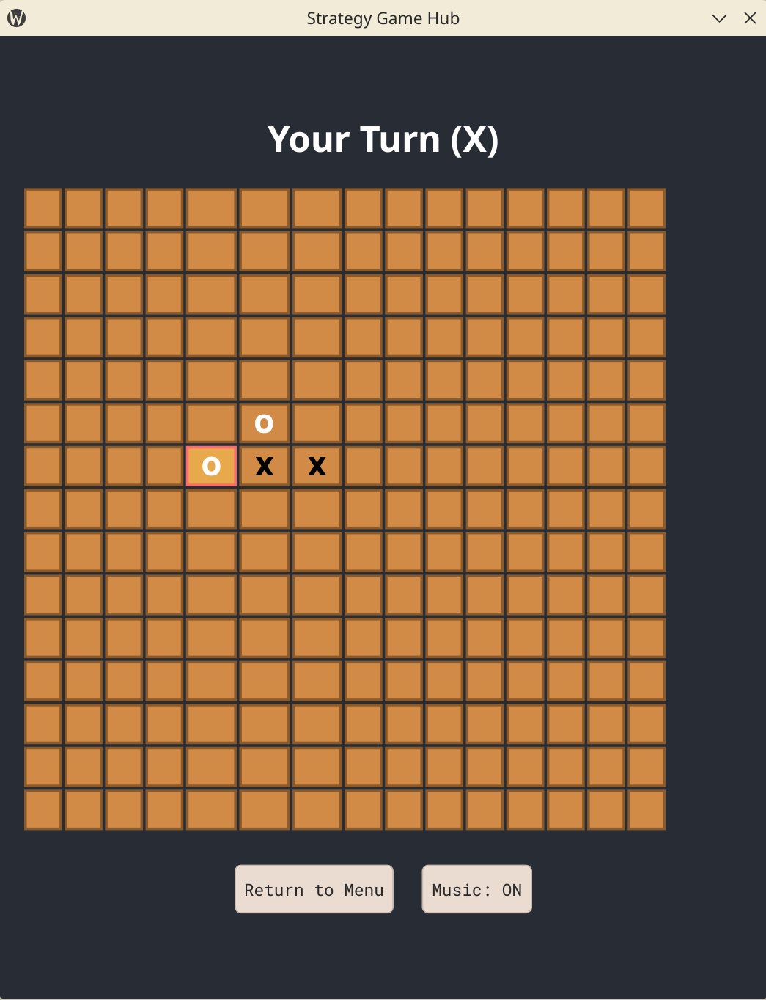
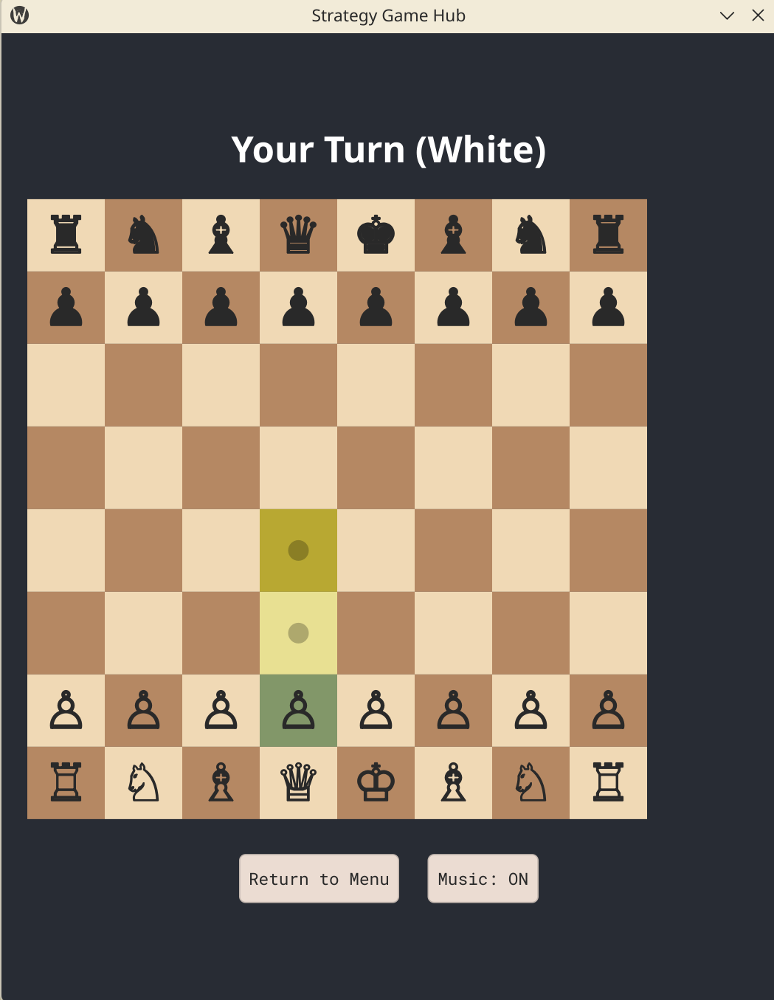
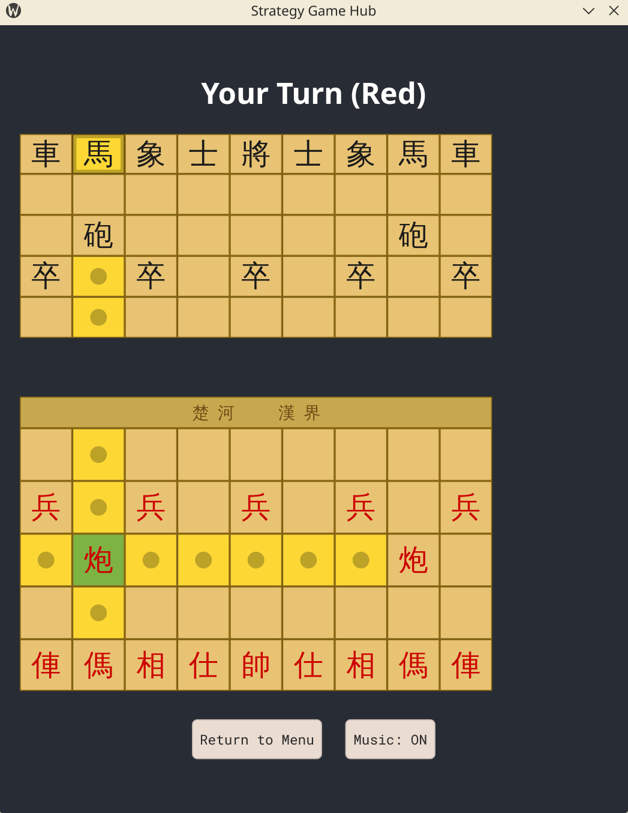

# Strategy Game Hub

A native super light-weight desktop board game collection built with **Rust** and **[Slint](https://slint.dev)**.
Play classic strategy games against a friend locally or challenge the built-in AI.

## Games

| Game | Board | AI | Description | Screenshot |
|------|-------|----|-------------|-----------|
| **Tic-Tac-Toe** | 3 x 3 | Minimax (perfect play) | The classic noughts and crosses | |
| **Gomoku** | 15 x 15 | Alpha-beta, depth 3 | Five in a row wins |  |
| **Chess** | 8 x 8 | Alpha-beta, depth 3 | Full FIDE rules (castling, en passant, promotion) |  |
| **Chinese Chess (Xiangqi)** | 10 x 9 | Alpha-beta, depth 3 | Traditional rules with flying general enforcement |  |

Every game supports **PvE** (vs AI) and **PvP** (local two-player) modes.

## Building

### Prerequisites

- [Rust](https://rustup.rs) (edition 2024)
- A C++ compiler (required by Slint for native rendering)
- Audio libraries for background music:
  - **Linux**: `libasound2-dev` (ALSA)
  - **macOS / Windows**: no extra dependencies

### Build & Run

```bash
cargo build          # compile
cargo run            # compile and launch
```

Slint UI files are compiled at build time via `build.rs` — any changes to `.slint` files require a rebuild.

## Project Structure

```
src/
├── main.rs            Entry point, audio, UI callbacks
├── state.rs           Shared game state (AppState, enums)
├── ttt.rs             Tic-Tac-Toe logic + minimax AI
├── gomoku.rs          Gomoku logic + alpha-beta AI
├── chess/
│   ├── mod.rs         Piece types, board initialization
│   ├── moves.rs       Move generation, check/checkmate/stalemate
│   └── ai.rs          Evaluation + alpha-beta search
└── xiangqi/
    ├── mod.rs         Piece types, board initialization
    ├── moves.rs       Move generation, flying general rule
    └── ai.rs          Evaluation + alpha-beta search

ui/
└── appwindow.slint    Full UI definition (menu + all game boards)

assets/
└── bgm.mp3           Background music (looped)

build.rs               Compiles .slint files at build time
```

## How It Works

- **UI framework**: [Slint](https://slint.dev) v1.15 generates Rust bindings at compile time. The UI communicates with Rust through properties and callbacks.
- **State management**: A single `AppState` struct behind `Arc<Mutex<>>` is shared across all UI callbacks.
- **AI**: Each game's AI runs on a background thread to keep the UI responsive. Results are applied back via `slint::invoke_from_event_loop`.
- **Audio**: Background music is played through [rodio](https://github.com/RustAudio/rodio) with a toggle in the menu and in-game.

## Controls

- **Menu**: Select a game and mode (1 Player or 2 Players)
- **Tic-Tac-Toe / Gomoku**: Click an empty cell to place your piece
- **Chess / Xiangqi**: Click a piece to select it (valid moves are highlighted), then click a destination to move. Click elsewhere to deselect.

This project is provided as-is for personal and educational use.
